# Indice de Documentacion - Framework Base QA

## Empieza aqui

Si es tu primera semana en el framework, lee en este orden:

### Primeras 2 horas
1. [docs/01-onboarding/LAS_HERRAMIENTAS_Y_POR_QUE.md](docs/01-onboarding/LAS_HERRAMIENTAS_Y_POR_QUE.md) ← empieza aquí si nunca usaste Selenium o Cucumber
2. [docs/01-onboarding/DIA1_CHECKLIST.md](docs/01-onboarding/DIA1_CHECKLIST.md) ← checklist paso a paso para instalar y correr el primer test
3. [docs/01-onboarding/COMO_FUNCIONA_EL_FRAMEWORK.md](docs/01-onboarding/COMO_FUNCIONA_EL_FRAMEWORK.md) ← lee esto antes de tocar código
4. [docs/01-onboarding/START_HERE.md](docs/01-onboarding/START_HERE.md)
5. [docs/01-onboarding/VSCODE_SETUP.md](docs/01-onboarding/VSCODE_SETUP.md) ← terminal recomendada (Git Bash) + instalación completa
6. [QUICK_RUN.md](QUICK_RUN.md) ← referencia completa de comandos Gradle (paralelo, secuencial, tags, rerun, Allure)

Objetivo de esta etapa:
- Abrir el proyecto en VS Code.
- Confirmar Java 21 y Gradle Wrapper.
- Ejecutar tu primer @Smoke en modo secuencial.
- Entender la relación Feature → Step → Page Object.

### Primer dia
1. [docs/01-onboarding/AUTOMATION_FOUNDATIONS_PLAYBOOK.md](docs/01-onboarding/AUTOMATION_FOUNDATIONS_PLAYBOOK.md)
2. [docs/03-templates/FEATURE_TEMPLATE.md](docs/03-templates/FEATURE_TEMPLATE.md)
3. [docs/03-templates/STEP_DEFINITION_TEMPLATE.md](docs/03-templates/STEP_DEFINITION_TEMPLATE.md)
4. [docs/03-templates/PAGE_OBJECT_TEMPLATE.md](docs/03-templates/PAGE_OBJECT_TEMPLATE.md)
5. [docs/02-governance/BASEPAGE_GUIDE.md](docs/02-governance/BASEPAGE_GUIDE.md) ← metodos disponibles en BasePage
6. [src/test/resources/features/Demo.feature](src/test/resources/features/Demo.feature) ← feature ejecutable real
7. [src/test/java/steps/DemoLoginSteps.java](src/test/java/steps/DemoLoginSteps.java) ← steps del demo
8. [src/test/java/pages/LoginPage.java](src/test/java/pages/LoginPage.java) ← page object del demo
9. [src/test/java/examples/EjemploPatronesSteps.java](src/test/java/examples/EjemploPatronesSteps.java) ← 10 patrones avanzados comentados
10. [src/test/java/models/UsuarioTestData.java](src/test/java/models/UsuarioTestData.java) ← ejemplo de modelo de datos

Objetivo de esta etapa:
- Crear tu primer feature real.
- Implementar steps y page object siguiendo el estandar.
- Entender que editar y que no tocar al inicio.

### Primera semana
1. [docs/01-onboarding/EJERCICIO_PRACTICO.md](docs/01-onboarding/EJERCICIO_PRACTICO.md) ← ejercicio guiado con el capacitador
2. [docs/01-onboarding/PRIMER_MR_AUTOMATION.md](docs/01-onboarding/PRIMER_MR_AUTOMATION.md)
3. [docs/01-onboarding/TROUBLESHOOTING_AUTOMATION.md](docs/01-onboarding/TROUBLESHOOTING_AUTOMATION.md)
4. [docs/02-governance/ALCANCE_Y_LIMITACIONES.md](docs/02-governance/ALCANCE_Y_LIMITACIONES.md) ← que SI y que NO puede automatizar este framework
5. [docs/02-governance/ASSERTIONS_Y_ANTI_FLAKY.md](docs/02-governance/ASSERTIONS_Y_ANTI_FLAKY.md) ← como escribir assertions robustas y eliminar tests flaky
6. [docs/02-governance/QA_AUTOMATION_STANDARD_V1.md](docs/02-governance/QA_AUTOMATION_STANDARD_V1.md)
6. [docs/02-governance/CUCUMBER_BDD_STYLE_GUIDE.md](docs/02-governance/CUCUMBER_BDD_STYLE_GUIDE.md)
7. [docs/02-governance/SELENIUM_JAVA_PRACTICES.md](docs/02-governance/SELENIUM_JAVA_PRACTICES.md)
8. [docs/02-governance/JAVA_DIRECTORY_STRUCTURE_STANDARD.md](docs/02-governance/JAVA_DIRECTORY_STRUCTURE_STANDARD.md)
9. [docs/02-governance/MR_QA_CHECKLIST.md](docs/02-governance/MR_QA_CHECKLIST.md)
10. [docs/02-governance/GESTION_DE_ENTORNOS.md](docs/02-governance/GESTION_DE_ENTORNOS.md)
11. [docs/02-governance/TRAZABILIDAD_REQUISITOS.md](docs/02-governance/TRAZABILIDAD_REQUISITOS.md)

Objetivo de esta etapa:
- Abrir tu primer MR con evidencia.
- Entender paralelismo, flakiness, rerun y criterios de calidad.
- Trabajar dentro del estándar sin romper pipeline ni gobernanza.
- Entender como CODEOWNERS y aprobaciones bloquean o habilitan merge.
- Revisar en QA_AUTOMATION_STANDARD_V1 la "Matriz oficial de madurez por rol".

## Si es tu primer dia, no leas esto todavia

Estos documentos son importantes, pero no son bloqueantes para arrancar:
- [docs/02-governance/BRANCHING_POLICY_BASE.md](docs/02-governance/BRANCHING_POLICY_BASE.md)
- [docs/02-governance/COMMIT_AND_BRANCH_NAMING_POLICY.md](docs/02-governance/COMMIT_AND_BRANCH_NAMING_POLICY.md)
- [docs/02-governance/RELEASE_CHECKLIST.md](docs/02-governance/RELEASE_CHECKLIST.md)
- [docs/02-governance/INTEGRACION_CON_PLANTILLA_DEVSECOPS.md](docs/02-governance/INTEGRACION_CON_PLANTILLA_DEVSECOPS.md)
- [docs/02-governance/GITLAB_PROJECT_HARDENING.md](docs/02-governance/GITLAB_PROJECT_HARDENING.md)
- [docs/BRANCHING_STRATEGY.md](docs/BRANCHING_STRATEGY.md)
- [docs/CHANGE_MANAGEMENT.md](docs/CHANGE_MANAGEMENT.md)
- [docs/architecture.mermaid](docs/architecture.mermaid)

Cuando leerlos:
- Despues de tu primer MR aprobado.
- Cuando participes en pipelines, ramas protegidas o despliegues.
- Cuando actues como referente tecnico, senior QA o arquitectura.

## Ruta recomendada por perfil

### Inicio en automatizacion
- [docs/01-onboarding/LAS_HERRAMIENTAS_Y_POR_QUE.md](docs/01-onboarding/LAS_HERRAMIENTAS_Y_POR_QUE.md) ← cero conocimiento previo
- [docs/01-onboarding/DIA1_CHECKLIST.md](docs/01-onboarding/DIA1_CHECKLIST.md) ← primer paso obligatorio
- [docs/01-onboarding/COMO_FUNCIONA_EL_FRAMEWORK.md](docs/01-onboarding/COMO_FUNCIONA_EL_FRAMEWORK.md) ← conceptos base
- [docs/01-onboarding/START_HERE.md](docs/01-onboarding/START_HERE.md)
- [docs/01-onboarding/VSCODE_SETUP.md](docs/01-onboarding/VSCODE_SETUP.md)
- [docs/01-onboarding/AUTOMATION_FOUNDATIONS_PLAYBOOK.md](docs/01-onboarding/AUTOMATION_FOUNDATIONS_PLAYBOOK.md)
- [QUICK_RUN.md](QUICK_RUN.md)
- [docs/01-onboarding/GUIA_DEPURACION.md](docs/01-onboarding/GUIA_DEPURACION.md) ← cuando algo falla + cómo usar log.debug y ver logs
- [docs/01-onboarding/TROUBLESHOOTING_AUTOMATION.md](docs/01-onboarding/TROUBLESHOOTING_AUTOMATION.md)
- [docs/02-governance/QA_AUTOMATION_STANDARD_V1.md](docs/02-governance/QA_AUTOMATION_STANDARD_V1.md) (matriz de progresion por rol)

### QA Senior / Referente tecnico
- [docs/02-governance/PATRONES_DE_DISENO.md](docs/02-governance/PATRONES_DE_DISENO.md) ← leer antes que cualquier otro documento de gobernanza
- [docs/02-governance/QA_AUTOMATION_STANDARD_V1.md](docs/02-governance/QA_AUTOMATION_STANDARD_V1.md)
- [docs/02-governance/CUCUMBER_BDD_STYLE_GUIDE.md](docs/02-governance/CUCUMBER_BDD_STYLE_GUIDE.md)
- [docs/02-governance/SELENIUM_JAVA_PRACTICES.md](docs/02-governance/SELENIUM_JAVA_PRACTICES.md)
- [docs/02-governance/PARALELISMO_Y_ESCALABILIDAD.md](docs/02-governance/PARALELISMO_Y_ESCALABILIDAD.md)
- [docs/02-governance/QUALITY_GATES.md](docs/02-governance/QUALITY_GATES.md)
- [docs/02-governance/INTEGRACION_CON_PLANTILLA_DEVSECOPS.md](docs/02-governance/INTEGRACION_CON_PLANTILLA_DEVSECOPS.md)
- [docs/02-governance/GITLAB_PROJECT_HARDENING.md](docs/02-governance/GITLAB_PROJECT_HARDENING.md)

### Lider QA / Arquitectura
- [docs/BRANCHING_STRATEGY.md](docs/BRANCHING_STRATEGY.md)
- [docs/CHANGE_MANAGEMENT.md](docs/CHANGE_MANAGEMENT.md)
- [docs/02-governance/BRANCHING_POLICY_BASE.md](docs/02-governance/BRANCHING_POLICY_BASE.md)
- [docs/02-governance/QUALITY_GATES.md](docs/02-governance/QUALITY_GATES.md)
- [docs/02-governance/GITLAB_PROJECT_HARDENING.md](docs/02-governance/GITLAB_PROJECT_HARDENING.md)
- [docs/architecture.mermaid](docs/architecture.mermaid)

## Referencia completa por seccion

### Onboarding
- [docs/01-onboarding/GUIA_CAPACITADOR.md](docs/01-onboarding/GUIA_CAPACITADOR.md) ← solo para el capacitador
- [docs/01-onboarding/LAS_HERRAMIENTAS_Y_POR_QUE.md](docs/01-onboarding/LAS_HERRAMIENTAS_Y_POR_QUE.md)
- [docs/01-onboarding/DIA1_CHECKLIST.md](docs/01-onboarding/DIA1_CHECKLIST.md)
- [docs/01-onboarding/COMO_FUNCIONA_EL_FRAMEWORK.md](docs/01-onboarding/COMO_FUNCIONA_EL_FRAMEWORK.md)
- [docs/01-onboarding/START_HERE.md](docs/01-onboarding/START_HERE.md)
- [docs/01-onboarding/VSCODE_SETUP.md](docs/01-onboarding/VSCODE_SETUP.md)
- [docs/01-onboarding/AUTOMATION_FOUNDATIONS_PLAYBOOK.md](docs/01-onboarding/AUTOMATION_FOUNDATIONS_PLAYBOOK.md)
- [docs/01-onboarding/EJERCICIO_PRACTICO.md](docs/01-onboarding/EJERCICIO_PRACTICO.md)
- [docs/01-onboarding/PRIMER_MR_AUTOMATION.md](docs/01-onboarding/PRIMER_MR_AUTOMATION.md)
- [docs/01-onboarding/GUIA_DEPURACION.md](docs/01-onboarding/GUIA_DEPURACION.md)
- [docs/01-onboarding/TROUBLESHOOTING_AUTOMATION.md](docs/01-onboarding/TROUBLESHOOTING_AUTOMATION.md)
- [docs/01-onboarding/GLOSARIO_QA_DEVSECOPS.md](docs/01-onboarding/GLOSARIO_QA_DEVSECOPS.md)
- [QUICK_RUN.md](QUICK_RUN.md)

### Plantillas y ejemplos
- [docs/03-templates/FEATURE_TEMPLATE.md](docs/03-templates/FEATURE_TEMPLATE.md)
- [docs/03-templates/STEP_DEFINITION_TEMPLATE.md](docs/03-templates/STEP_DEFINITION_TEMPLATE.md)
- [docs/03-templates/PAGE_OBJECT_TEMPLATE.md](docs/03-templates/PAGE_OBJECT_TEMPLATE.md)
- [src/test/resources/features/Demo.feature](src/test/resources/features/Demo.feature) ← feature demo ejecutable
- [src/test/java/steps/DemoLoginSteps.java](src/test/java/steps/DemoLoginSteps.java) ← steps del demo ejecutable
- [src/test/java/pages/LoginPage.java](src/test/java/pages/LoginPage.java) ← page object del demo ejecutable
- [src/test/java/examples/EjemploPatronesSteps.java](src/test/java/examples/EjemploPatronesSteps.java) ← catálogo de patrones avanzados
- [src/test/java/models/UsuarioTestData.java](src/test/java/models/UsuarioTestData.java) ← ejemplo de modelo de datos

### Gobernanza
- [docs/02-governance/ALCANCE_Y_LIMITACIONES.md](docs/02-governance/ALCANCE_Y_LIMITACIONES.md) ← que SI y que NO puede automatizar este framework
- [docs/02-governance/ASSERTIONS_Y_ANTI_FLAKY.md](docs/02-governance/ASSERTIONS_Y_ANTI_FLAKY.md) ← assertions correctas y eliminacion de tests flaky
- [docs/02-governance/PARALELISMO_Y_ESCALABILIDAD.md](docs/02-governance/PARALELISMO_Y_ESCALABILIDAD.md)
- [docs/02-governance/GESTION_DE_ENTORNOS.md](docs/02-governance/GESTION_DE_ENTORNOS.md)
- [docs/02-governance/TRAZABILIDAD_REQUISITOS.md](docs/02-governance/TRAZABILIDAD_REQUISITOS.md)
- [docs/02-governance/METRICAS_Y_KPIs_QA.md](docs/02-governance/METRICAS_Y_KPIs_QA.md)
- [docs/02-governance/CODE_COVERAGE_POLICY.md](docs/02-governance/CODE_COVERAGE_POLICY.md)
- [docs/02-governance/BRANCHING_POLICY_BASE.md](docs/02-governance/BRANCHING_POLICY_BASE.md)
- [docs/02-governance/COMMIT_AND_BRANCH_NAMING_POLICY.md](docs/02-governance/COMMIT_AND_BRANCH_NAMING_POLICY.md)
- [docs/02-governance/RELEASE_CHECKLIST.md](docs/02-governance/RELEASE_CHECKLIST.md)
- [docs/02-governance/QA_AUTOMATION_STANDARD_V1.md](docs/02-governance/QA_AUTOMATION_STANDARD_V1.md)
- [docs/02-governance/CUCUMBER_BDD_STYLE_GUIDE.md](docs/02-governance/CUCUMBER_BDD_STYLE_GUIDE.md)
- [docs/02-governance/SELENIUM_JAVA_PRACTICES.md](docs/02-governance/SELENIUM_JAVA_PRACTICES.md)
- [docs/02-governance/PATRONES_DE_DISENO.md](docs/02-governance/PATRONES_DE_DISENO.md) ← los 6 patrones del framework y por qué existen
- [docs/02-governance/BASEPAGE_GUIDE.md](docs/02-governance/BASEPAGE_GUIDE.md) ← referencia completa de metodos BasePage
- [docs/02-governance/JAVA_DIRECTORY_STRUCTURE_STANDARD.md](docs/02-governance/JAVA_DIRECTORY_STRUCTURE_STANDARD.md)
- [docs/02-governance/NAMING_CONVENTIONS.md](docs/02-governance/NAMING_CONVENTIONS.md)
- [docs/02-governance/QUALITY_GATES.md](docs/02-governance/QUALITY_GATES.md)
- [docs/02-governance/MR_QA_CHECKLIST.md](docs/02-governance/MR_QA_CHECKLIST.md)
- [docs/02-governance/SECURITY_AND_TEST_DATA_POLICY.md](docs/02-governance/SECURITY_AND_TEST_DATA_POLICY.md)
- [docs/02-governance/INTEGRACION_CON_PLANTILLA_DEVSECOPS.md](docs/02-governance/INTEGRACION_CON_PLANTILLA_DEVSECOPS.md)
- [docs/02-governance/GITLAB_PROJECT_HARDENING.md](docs/02-governance/GITLAB_PROJECT_HARDENING.md)

### Corporativo DevSecOps
- [docs/BRANCHING_STRATEGY.md](docs/BRANCHING_STRATEGY.md)
- [docs/CHANGE_MANAGEMENT.md](docs/CHANGE_MANAGEMENT.md)
- [docs/architecture.mermaid](docs/architecture.mermaid)
- [docs/04-executive/architecture.svg](docs/04-executive/architecture.svg)

Vista renderizada:

### Plantillas GitLab
- [.gitlab/merge_request_templates/DEFAULT.md](.gitlab/merge_request_templates/DEFAULT.md)
- [.gitlab/ci/qa-automation.yml](.gitlab/ci/qa-automation.yml)

### Ejecutivo
- [docs/04-executive/READINESS_CHECK_2026_03_16.md](docs/04-executive/READINESS_CHECK_2026_03_16.md)
